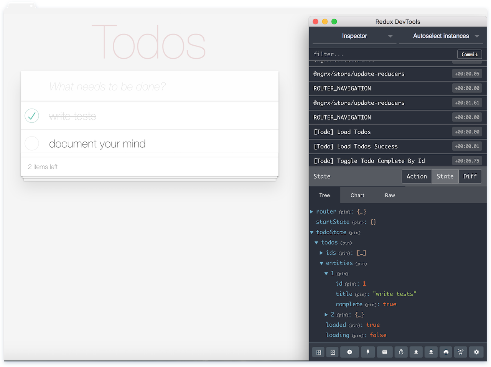

# AngularNgrxBlueprint



We created this small example project with [Angular CLI](https://github.com/angular/angular-cli) version 6.1.7:

`ng new angular-ngrx-blueprint --style=scss`

Features

* Angular Version 6
* lazy loading [feature modules](https://angular.io/guide/feature-modules)
* application state managing with [ngrx](http://ngrx.github.io/)
* each feature state has it's own state in the app store
* internationalization [ngx-translate](http://www.ngx-translate.com/) with enabled "WebpackTranslateLoader"

## Application State Managing

We use the *ngrx* platform for our application state architecture <https://github.com/ngrx/platform>

Additional general information about our store structure can be found in the wiki folder "wiki/architecture-app-state.md"

The whole store was initially installed with:

```
npm install @ngrx/{store,effects,entity,router-store,store-devtools} --save
npm install ngrx-store-freeze --save
npm install @ngrx/schematics --save-dev

ng config cli.defaultCollection @ngrx/schematics
```

The project has also devtools instrument installed. This enables powerful time-travel debugging within a browser extension: <https://github.com/zalmoxisus/redux-devtools-extension>

## Styling

Knowing that we use SASS: <https://scotch.io/tutorials/using-sass-with-the-angular-cli> for styling

Additional Information for Component Styles are here: <https://angular.io/guide/component-styles>

## Translation

Use ngx-translate library for i18n: <https://github.com/ngx-translate/core>

As the loader we use the webpack translate loader <https://github.com/ngx-translate/http-loader#angular-cliwebpack-translateloader-example> for loading the latest translation files available during the application build.

## Development server

Run `npm start` for a dev server. Navigate to `http://localhost:4200/`. The app will automatically reload if you change any of the source files.

## Code scaffolding

Run `ng generate component component-name` to generate a new component. You can also use `ng generate directive|pipe|service|class|guard|interface|enum|module`.

For example:

```
ng g module <featureModule>
ng g component <featureModule>/components/<component-name>
ng g service <featureModule>/services/<service-name>
```

Knowing that we use lazy loading feature modules <https://angular.io/guide/lazy-loading-ngmodules>

With *@ngrx/schematics* we can raise the nrgx scaffolding <https://github.com/ngrx/platform/blob/master/docs/schematics/README.md>

For example:

```
ng generate feature <featureFolder>/<FeatureSet> -m <feature>.module.ts --group
```

For just creating a new bundle (*actions*, *reducer* and *effect*) without module declaration (if feature state already exist)

```
ng generate feature <featureFolder>/<FeatureSet> --group
```

## Build

Run `npm build` to build the project. The build artifacts will be stored in the `dist/` directory. Use the `--prod` flag for a production build.

## Running unit tests

Run `npm test` to execute the unit tests via [Karma](https://karma-runner.github.io).

## Running end-to-end tests

Run `npm e2e` to execute the end-to-end tests via [Protractor](http://www.protractortest.org/).

## Further help

To get more help on the Angular CLI use `ng help` or go check out the [Angular CLI README](https://github.com/angular/angular-cli/blob/master/README.md).

HowTo Components OnPush Change Detection <https://netbasal.com/a-comprehensive-guide-to-angular-onpush-change-detection-strategy-5bac493074a4>

RxJS 5 Operators By Example <https://gist.github.com/btroncone/d6cf141d6f2c00dc6b35> and pipeable operators <https://github.com/ReactiveX/rxjs/blob/master/doc/pipeable-operators.md>

Debugging Angular apps in Webstorm <https://blog.jetbrains.com/webstorm/2017/01/debugging-angular-apps/>
