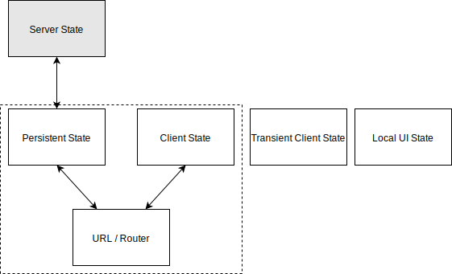
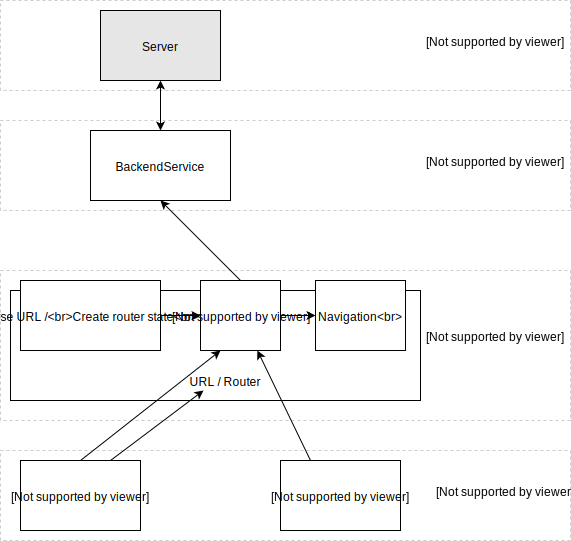
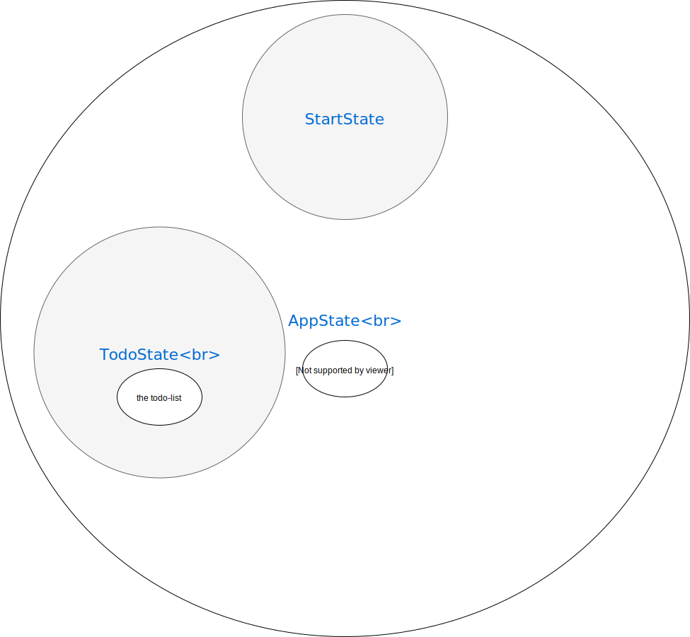

# Managing State

## General

Managing state is a hard problem. We need to coordinate (multiple) backends, web workers, and UI components, all of which update the state concurrently.

What should we store in memory and what in the URL? What about the local UI state? How do we synchronize the persistent state, the URL, and the state on the server? All these questions have to be answered when designing the state management of our application.

Typically we have a **Server State** and a **Client State**. The server state is stored, unsurprisingly, on the server and is provided via, for example, a REST endpoint. The persistent state is a subset of the server state stored on the client, in memory. The client state is not stored on the server. A good example is the filters used to create a list of items displayed to the user.

The persistent state and the server state store the same information. So do the client state and the URL. Because of this we have to synchronize them. And the choice of the synchronization strategy is one of the most important decisions we make when designing the state management of our applications.

## Introducing NgRx

With [ngrx platform](https://github.com/ngrx/platform) we get a holistic way of state management. We can separate the state management from the computation and services. We clearly define the synchronization strategy of the persistent state and the server and so on.

That tool raise a single application store. The strategy is connecting small pure function called "reducers" to the store. We should treat the store as the source of truth.

**NgRx should the means of achieving a goal, not the goal**

# Application State Overview

## RouterState

Here we synchronize the store with the router. The [router-store](https://github.com/ngrx/router-store) track all the navigation part in our store.
So we can select the current URL in a component. And we can also programmatically navigate with router *actions*.

Since the user can always interact with the URL directly, so the router is also a initiator of actions.

## Feature States

### StartState (in StartModule)

#### TodosState (in TodosModule)

Our first feature State is the TodosState with the todo state. It represent the todos data from server as a persistent state and have to be in sync with the server state.

When we loading the todo data with our Loading *action* then a *side effect* will be triggered to get the data from the server via a *service*. If the server response is "Ok" then the Loading Success *action* will be triggered and the data put to the Store.

In TodoPageComponent we *select* the data in the OnInit method.

***

Comprehensive Introduction: <https://gist.github.com/btroncone/a6e4347326749f938510>

note: the embedded .svg is made with <https://www.draw.io/> 
