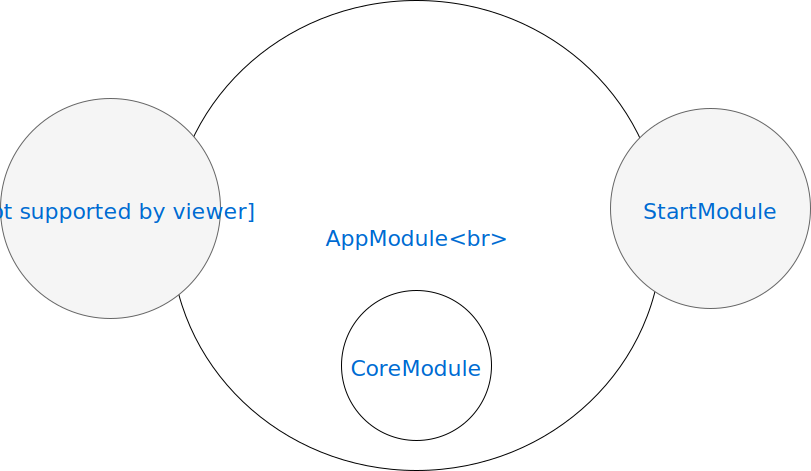

# Architecture Modules

Angular apps are modular. So we use it's own modularity system called *NgModules*. While a small application might have only one NgModule, most apps have many more **feature modules**.

So I'll give you an overview of our modules:

Knowing that we use [lazy loading modules](https://angular.io/guide/lazy-loading-ngmodules) for the most of our feature modules (which have the grey background).

***

see also: <https://angular.io/guide/architecture-modules>

note: the embedded .svg is made with <https://www.draw.io/> 